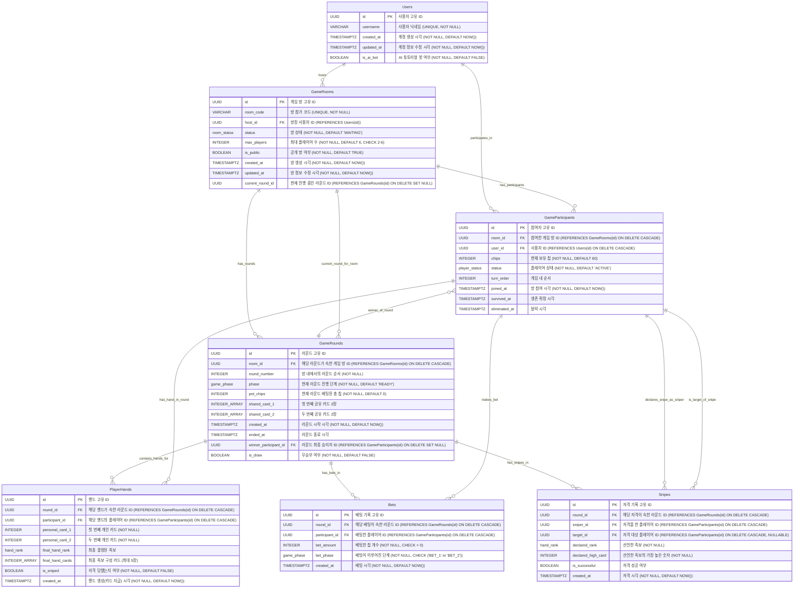

# 저격 홀덤 Web - ERD (Entity Relationship Diagram)

이 문서는 `db-schema.md`의 데이터베이스 스키마를 기반으로 작성된 ERD입니다. MermaidJS 형식을 사용하여 표현되었습니다.

**엔티티 설명:**

*   **Users**: 사용자 계정 정보
*   **GameRooms**: 게임 방 정보
*   **GameParticipants**: 게임 방에 참여한 플레이어 정보 (어떤 유저가 어떤 방에 어떤 상태로 있는지)
*   **GameRounds**: 게임 방 내에서 진행되는 각 라운드의 정보
*   **PlayerHands**: 라운드별 플레이어의 개인 카드 및 최종 패 정보
*   **Bets**: 라운드별 베팅 기록
*   **Snipes**: 라운드별 저격 기록

**관계 설명:**

*   `Users` (1) : (N) `GameRooms` (한 명의 유저는 여러 방의 방장일 수 있음 - host_id)
*   `Users` (1) : (N) `GameParticipants` (한 명의 유저는 여러 방에 참여자로 존재 가능)
*   `GameRooms` (1) : (N) `GameParticipants` (하나의 게임 방은 여러 참여자를 가짐)
*   `GameRooms` (1) : (N) `GameRounds` (하나의 게임 방은 여러 라운드를 가짐)
*   `GameRounds` (1) : (N) `PlayerHands` (하나의 라운드는 여러 플레이어의 패 정보를 가짐)
*   `GameRounds` (1) : (N) `Bets` (하나의 라운드는 여러 베팅 기록을 가짐)
*   `GameRounds` (1) : (N) `Snipes` (하나의 라운드는 여러 저격 기록을 가짐)
*   `GameParticipants` (1) : (N) `PlayerHands` (한 참여자는 여러 라운드에 걸쳐 패 정보를 가질 수 있음)
*   `GameParticipants` (1) : (N) `Bets` (한 참여자는 여러 베팅을 할 수 있음)
*   `GameParticipants` (1) : (N) `Snipes` (한 참여자는 여러 저격을 할 수 있음 - sniper_id)
*   `GameParticipants` (0..1) : (N) `Snipes` (한 참여자는 여러 번 저격 대상이 될 수 있음 - target_id, NULL 허용)
*   `GameRounds` (0..1) -- `GameRooms` (하나의 게임방은 현재 진행중인 라운드 정보를 가질 수 있음 - current_round_id)
*   `GameParticipants` (0..1) -- `GameRounds` (하나의 라운드는 승리자 정보를 가질 수 있음 - winner_participant_id)

**표기법:**

*   `PK`: Primary Key
*   `FK`: Foreign Key
*   `||--o{`: One-to-Many
*   `}o--||`: Many-to-One (화살표 방향으로 읽을 때)

**참고:**

*   Enum 타입들 (`room_status`, `player_status`, `hand_rank`, `game_phase`)은 각 테이블의 컬럼 타입으로 사용되며, ERD에서는 컬럼 설명에 명시했습니다.
*   UNIQUE 제약 조건 등은 `db-schema.md`에 상세히 명시되어 있으며, ERD에서는 주석으로 간략히 표시하거나 생략했습니다.
*   `INTEGER_ARRAY`는 `INTEGER[]` (PostgreSQL 배열 타입)을 의미합니다.

이 ERD는 데이터베이스의 구조와 테이블 간의 관계를 시각적으로 이해하는 데 도움을 줄 것입니다. 