# 저격 홀덤 Web - ERD (Entity Relationship Diagram)

이 문서는 `db-schema.md`의 데이터베이스 스키마를 기반으로 작성된 ERD입니다. MermaidJS 형식을 사용하여 표현되었습니다.

```mermaid
erDiagram
    Users {
        UUID id PK "사용자 고유 ID"
        VARCHAR username "사용자 닉네임 (UNIQUE, NOT NULL)"
        TIMESTAMPTZ created_at "계정 생성 시각 (NOT NULL, DEFAULT NOW())"
        TIMESTAMPTZ updated_at "계정 정보 수정 시각 (NOT NULL, DEFAULT NOW())"
        BOOLEAN is_ai_bot "AI 튜토리얼 봇 여부 (NOT NULL, DEFAULT FALSE)"
    }

    GameRooms {
        UUID id PK "게임 방 고유 ID"
        VARCHAR room_code "방 참가 코드 (UNIQUE, NOT NULL)"
        UUID host_id FK "방장 사용자 ID (REFERENCES Users(id))"
        UUID room_status_id FK "방 상태 ID (REFERENCES RoomStatuses(id))"
        INTEGER max_players "최대 플레이어 수 (NOT NULL, DEFAULT 6, CHECK 2-6)"
        BOOLEAN is_public "공개 방 여부 (NOT NULL, DEFAULT TRUE)"
        TIMESTAMPTZ created_at "방 생성 시각 (NOT NULL, DEFAULT NOW())"
        TIMESTAMPTZ updated_at "방 정보 수정 시각 (NOT NULL, DEFAULT NOW())"
        UUID current_round_id FK "현재 진행 중인 라운드 ID (REFERENCES GameRounds(id) ON DELETE SET NULL)"
    }

    GameParticipants {
        UUID id PK "참여자 고유 ID"
        UUID room_id FK "참여한 게임 방 ID (REFERENCES GameRooms(id) ON DELETE CASCADE)"
        UUID user_id FK "사용자 ID (REFERENCES Users(id) ON DELETE CASCADE)"
        INTEGER chips "현재 보유 칩 (NOT NULL, DEFAULT 60)"
        UUID player_status_id FK "플레이어 상태 ID (REFERENCES PlayerStatuses(id))"
        INTEGER turn_order "게임 내 순서"
        TIMESTAMPTZ joined_at "방 참여 시각 (NOT NULL, DEFAULT NOW())"
        TIMESTAMPTZ survived_at "생존 확정 시각"
        TIMESTAMPTZ eliminated_at "탈락 시각"
    }

    GameRounds {
        UUID id PK "라운드 고유 ID"
        UUID room_id FK "해당 라운드가 속한 게임 방 ID (REFERENCES GameRooms(id) ON DELETE CASCADE)"
        INTEGER round_number "방 내에서의 라운드 순서 (NOT NULL)"
        UUID game_phase_id FK "현재 라운드 진행 단계 ID (REFERENCES GamePhases(id))"
        INTEGER pot_chips "현재 라운드 베팅된 총 칩 (NOT NULL, DEFAULT 0)"
        TIMESTAMPTZ created_at "라운드 시작 시각 (NOT NULL, DEFAULT NOW())"
        TIMESTAMPTZ ended_at "라운드 종료 시각"
        UUID winner_participant_id FK "라운드 최종 승리자 ID (REFERENCES GameParticipants(id) ON DELETE SET NULL)"
        BOOLEAN is_draw "무승부 여부 (NOT NULL, DEFAULT FALSE)"
    }

    PlayerHands {
        UUID id PK "핸드 고유 ID"
        UUID round_id FK "해당 핸드가 속한 라운드 ID (REFERENCES GameRounds(id) ON DELETE CASCADE)"
        UUID participant_id FK "해당 핸드의 플레이어 ID (REFERENCES GameParticipants(id) ON DELETE CASCADE)"
        INTEGER personal_card_1 "첫 번째 개인 카드 (1-10 사이 값, NOT NULL)"
        INTEGER personal_card_2 "두 번째 개인 카드 (1-10 사이 값, NOT NULL, personal_card_1과 중복 불가)"
        UUID hand_rank_id FK "최종 결정된 족보 ID (REFERENCES HandRanks(id) NULL 허용)"
        BOOLEAN is_sniped "저격 당했는지 여부 (NOT NULL, DEFAULT FALSE)"
        TIMESTAMPTZ created_at "핸드 생성(카드 지급) 시각 (NOT NULL, DEFAULT NOW())"
    }

    Bets {
        UUID id PK "베팅 기록 고유 ID"
        UUID round_id FK "해당 베팅이 속한 라운드 ID (REFERENCES GameRounds(id) ON DELETE CASCADE)"
        UUID participant_id FK "베팅한 플레이어 ID (REFERENCES GameParticipants(id) ON DELETE CASCADE)"
        INTEGER bet_amount "베팅한 칩 개수 (NOT NULL, CHECK > 0)"
        UUID bet_phase_id FK "베팅이 이루어진 게임 단계 ID (REFERENCES GamePhases(id))"
        TIMESTAMPTZ created_at "베팅 시각 (NOT NULL, DEFAULT NOW())"
    }

    Snipes {
        UUID id PK "저격 기록 고유 ID"
        UUID round_id FK "해당 저격이 속한 라운드 ID (REFERENCES GameRounds(id) ON DELETE CASCADE)"
        UUID sniper_id FK "저격을 한 플레이어 ID (REFERENCES GameParticipants(id) ON DELETE CASCADE)"
        UUID declared_rank_id FK "선언한 족보 ID (REFERENCES HandRanks(id))"
        INTEGER declared_high_card "선언한 족보의 가장 높은 숫자 (NOT NULL)"
        BOOLEAN is_successful "저격 성공 여부"
        TIMESTAMPTZ created_at "저격 시각 (NOT NULL, DEFAULT NOW())"
    }

    RoomStatuses {
        UUID id PK "방 상태 고유 ID"
        VARCHAR status_name "방 상태명 (UNIQUE, NOT NULL, 예: WAITING, PLAYING, FINISHED)"
    }

    PlayerStatuses {
        UUID id PK "플레이어 상태 고유 ID"
        VARCHAR status_name "플레이어 상태명 (UNIQUE, NOT NULL, 예: ACTIVE, FOLDED, ELIMINATED, ALL_IN)"
    }

    GamePhases {
        UUID id PK "게임 단계 고유 ID"
        VARCHAR phase_name "게임 진행 단계명 (UNIQUE, NOT NULL, 예: READY, DEAL_PERSONAL_CARDS, REVEAL_SHARED_CARDS_1, BETTING_1, REVEAL_SHARED_CARDS_2, BETTING_2, SNIPING, SHOWDOWN, SETTLEMENT)"
    }

    HandRanks {
        UUID id PK "족보 고유 ID"
        VARCHAR rank_name "족보명 (UNIQUE, NOT NULL, 예: FOUR_OF_A_KIND, FULL_HOUSE, STRAIGHT, TRIPLE, TWO_PAIR, ONE_PAIR, HIGH_CARD)"
    }

    SharedCards {
        UUID id PK "공유 카드 레코드 고유 ID"
        UUID round_id FK "해당 카드가 속한 라운드 ID (REFERENCES GameRounds(id) ON DELETE CASCADE)"
        INTEGER card_value "카드 값 (1-10 사이 값, NOT NULL)"
        INTEGER deal_order "라운드 내 공유 순서 (NOT NULL, 예: 1=플랍1, 2=플랍2, ..., 5=리버)"
        TIMESTAMPTZ created_at "카드 공개 시각 (NOT NULL, DEFAULT NOW())"
    }

    FinalHandCompositionCards {
        UUID id PK "최종 핸드 구성 카드 레코드 고유 ID"
        UUID player_hand_id FK "해당 카드가 속한 플레이어 핸드 ID (REFERENCES PlayerHands(id) ON DELETE CASCADE)"
        INTEGER card_value "카드 값 (1-10 사이 값, NOT NULL)"
        INTEGER card_order_in_hand "핸드 내 카드 순서 (1-5, 족보 구성 시)"
        TIMESTAMPTZ created_at "카드 정보 생성 시각 (NOT NULL, DEFAULT NOW())"
    }

    Users |o--|| GameRooms : "hosts"
    Users |o--|| GameParticipants : "participates_in"
    GameRooms ||--o{ GameParticipants : "has_participants"
    GameRooms ||--o{ GameRounds : "has_rounds"
    GameRooms }o--|| RoomStatuses : "has_status"
    GameRooms }o--|| GameRounds : "current_round_for_room"
    GameParticipants ||--o{ PlayerHands : "has_hand_in_round"
    GameParticipants ||--o{ Bets : "makes_bet"
    GameParticipants ||--o{ Snipes : "declares_snipe_as_sniper"
    GameParticipants }o--|| PlayerStatuses : "has_status"
    GameRounds ||--o{ PlayerHands : "contains_hands_for"
    GameRounds ||--o{ Bets : "has_bets_in"
    GameRounds ||--o{ Snipes : "has_snipes_in"
    GameRounds ||--o{ SharedCards : "has_shared_cards"
    GameRounds }o--|| GamePhases : "is_in_phase"
    GameRounds }o--|| GameParticipants : "winner_of_round"
    PlayerHands ||--o{ FinalHandCompositionCards : "composed_of_cards"
    PlayerHands }o--|| HandRanks : "is_of_rank"
    Bets }o--|| GamePhases : "occurs_in_phase"
    Snipes }o--|| HandRanks : "declares_rank"

```

**엔티티 설명:**

*   **Users**: 사용자 계정 정보
*   **GameRooms**: 게임 방 정보. `room_status_id`를 통해 `RoomStatuses` 테이블을 참조하여 방의 현재 상태(대기중, 진행중 등)를 관리합니다.
*   **GameParticipants**: 게임 방에 참여한 플레이어 정보. `player_status_id`를 통해 `PlayerStatuses` 테이블을 참조하여 플레이어의 현재 상태(활성, 폴드, 탈락 등)를 관리합니다.
*   **GameRounds**: 게임 방 내에서 진행되는 각 라운드의 정보. `game_phase_id`를 통해 `GamePhases` 테이블을 참조하여 라운드의 현재 진행 단계(개인 카드 지급, 첫 공유카드 공개, 첫 베팅 등)를 관리합니다. 공유 카드는 `SharedCards` 테이블을 통해 관리됩니다.
*   **PlayerHands**: 라운드별 플레이어의 개인 카드 및 최종 패 정보. `hand_rank_id`를 통해 `HandRanks` 테이블을 참조하여 최종 결정된 족보를 관리합니다. 최종 핸드를 구성하는 카드들은 `FinalHandCompositionCards` 테이블을 통해 관리됩니다.
*   **Bets**: 라운드별 베팅 기록. `bet_phase_id`를 통해 `GamePhases`를 참조하여 어떤 게임 단계(예: BETTING_1)에서 베팅이 이루어졌는지 기록합니다.
*   **Snipes**: 라운드별 저격 기록. `declared_rank_id`를 통해 `HandRanks` 테이블을 참조하여 플레이어가 선언한 족보를 관리합니다.
*   **RoomStatuses**: 게임 방의 상태 코드 및 이름 정의 (예: 'WAITING', 'PLAYING').
*   **PlayerStatuses**: 플레이어의 상태 코드 및 이름 정의 (예: 'ACTIVE', 'FOLDED').
*   **GamePhases**: 게임 라운드의 진행 단계 코드 및 이름 정의 (예: 'READY', 'DEAL_PERSONAL_CARDS', 'BETTING_1').
*   **HandRanks**: 포커 핸드의 족보 코드 및 이름 정의 (예: 'FOUR_OF_A_KIND', 'STRAIGHT').
*   **SharedCards**: 라운드에서 공개되는 공유 카드(커뮤니티 카드) 정보. 각 카드는 개별 레코드로 저장됩니다. (카드 값: 1-10)
*   **FinalHandCompositionCards**: 플레이어의 최종 핸드(족보)를 구성하는 카드들의 정보. 각 구성 카드는 개별 레코드로 저장됩니다. (카드 값: 1-10)

**관계 설명:**

*   Users (1) : (0..1) GameRooms (한 명의 유저는 최대 하나의 게임 방의 방장일 수 있습니다. 이 관계를 적용하려면 GameRooms 테이블의 host_id 컬럼에 UNIQUE 제약조건을 가져야 합니다 - host_id)
*   Users (1) : (0..1) GameParticipants (한 명의 유저는 최대 하나의 게임 방에만 참여자로 존재 가능합니다. 이 관계를 적용하려면 GameParticipants 테이블의 user_id 컬럼에 UNIQUE 제약조건을 가져야 합니다 - user_id)
*   `GameRooms` (1) : (N) `GameParticipants` (하나의 게임 방은 여러 참여자를 가짐)
*   `GameRooms` (1) : (N) `GameRounds` (하나의 게임 방은 여러 라운드를 가짐)
*   `GameRooms` (N) : (1) `RoomStatuses` (하나의 게임 방은 하나의 상태를 가짐 - `room_status_id`)
*   `GameRooms` (1) : (0..1) `GameRounds` (하나의 게임 방은 현재 진행중인 라운드 정보를 가질 수 있음 - `current_round_id`)
*   `GameParticipants` (1) : (N) `PlayerHands` (한 참여자는 여러 라운드에 걸쳐 패 정보를 가질 수 있음)
*   `GameParticipants` (1) : (N) `Bets` (한 참여자는 여러 베팅을 할 수 있음)
*   `GameParticipants` (1) : (N) `Snipes` (한 참여자는 여러 저격을 할 수 있음 - `sniper_id`)
*   `GameParticipants` (N) : (1) `PlayerStatuses` (한 참여자는 하나의 상태를 가짐 - `player_status_id`)
*   `GameRounds` (1) : (N) `PlayerHands` (하나의 라운드는 여러 플레이어의 패 정보를 가짐)
*   `GameRounds` (1) : (N) `Bets` (하나의 라운드는 여러 베팅 기록을 가짐)
*   `GameRounds` (1) : (N) `Snipes` (하나의 라운드는 여러 저격 기록을 가짐)
*   `GameRounds` (1) : (N) `SharedCards` (하나의 라운드는 여러 장의 공유 카드를 가짐)
*   `GameRounds` (N) : (1) `GamePhases` (하나의 라운드는 하나의 진행 단계를 가짐 - `game_phase_id`)
*   `GameRounds` (1) : (0..1) `GameParticipants` (하나의 라운드는 승리자 정보를 가질 수 있음 - `winner_participant_id`)
*   `PlayerHands` (1) : (N) `FinalHandCompositionCards` (하나의 플레이어 핸드는 여러 장의 구성 카드를 가짐)
*   `PlayerHands` (N) : (0..1) `HandRanks` (하나의 플레이어 핸드는 하나의 최종 족보를 가질 수 있음 - `hand_rank_id`)
*   `Bets` (N) : (1) `GamePhases` (하나의 베팅은 특정 게임 단계에서 이루어짐 - `bet_phase_id`)
*   `Snipes` (N) : (1) `HandRanks` (하나의 저격 시도는 특정 족보를 선언함 - `declared_rank_id`)

**표기법:**

*   `PK`: Primary Key
*   `FK`: Foreign Key
*   `||--o{`: One-to-Many
*   `}o--||`: Many-to-One (또는 One-to-One, 화살표 방향으로 읽을 때 FK를 가진 쪽이 Many 또는 One)

**참고:**

*   **엔티티 및 속성 명명:** 컬럼명 `personal_card_1`, `personal_card_2`와 같이 특정 개수가 고정된 속성은 확장성보다는 명확성을 위해 그대로 유지했습니다. 다중 값을 가질 수 있는 카드 정보(공유 카드, 최종 핸드 구성 카드)는 별도 테이블로 분리하여 정규화했습니다. `card_value`는 카드를 고유하게 식별하는 값(1-10 범위의 정수)을 의미합니다.
*   **타입 관리 (Enum 대체):** 기존에 인라인으로 사용되던 `room_status`, `player_status`, `game_phase`, `hand_rank`와 같은 상태 및 유형 정보는 별도의 조회 테이블 (`RoomStatuses`, `PlayerStatuses`, `GamePhases`, `HandRanks`)로 분리하여 관리합니다. 각 주 테이블은 해당 조회 테이블의 ID를 외래 키로 참조하여 유지보수성과 확장성을 향상시켰습니다. 각 조회 테이블의 `*_name` 컬럼에 예시값을 명시했습니다. `HandRanks`의 예시는 `FOUR_OF_A_KIND`, `FULL_HOUSE` 등 실제 게임 룰에 따릅니다. `GamePhases`의 예시는 `DEAL_PERSONAL_CARDS`, `BETTING_1` 등 실제 게임 단계에 맞게 수정되었습니다.
*   **카드 정보 모델링:** `GameRounds`의 공유 카드 정보 및 `PlayerHands`의 최종 핸드 구성 카드 정보는 기존 `INTEGER_ARRAY` 방식에서 별도의 테이블 (`SharedCards`, `FinalHandCompositionCards`)로 변경되었습니다. 이를 통해 각 카드 정보를 개별 레코드로 관리하고, 카드 값(1-10)에 대한 제약 조건 적용 및 복잡한 카드 관련 쿼리를 용이하게 합니다.
*   **데이터 무결성:** 외래 키에는 `ON DELETE CASCADE` 또는 `ON DELETE SET NULL` 옵션을 사용하여 참조 무결성을 유지합니다. `UNIQUE` 제약 조건, `CHECK` 제약 등은 `db-schema.md`에 상세히 명시되어 있으며, ERD에서는 주요 사항만 주석으로 간략히 표시했습니다. (예: `PlayerHands.personal_card_2`는 `personal_card_1`과 중복될 수 없습니다.)
*   **물리적 최적화 고려 사항 (권장):**
    *   **인덱싱:** 외래 키(FK) 컬럼, `GameRooms.room_code`, `Users.username`, `GameRounds.round_number` 등 자주 조회 조건으로 사용되는 컬럼에는 인덱스를 생성하여 조회 성능을 향상시키는 것을 권장합니다.
    *   **파티셔닝:** 데이터가 누적되어 크기가 매우 커질 가능성이 있는 테이블 (예: `GameRounds`, `Bets`, `Snipes`, `SharedCards`, `PlayerHands`)에 대해서는 생성 날짜 등을 기준으로 파티셔닝을 적용하여 데이터 관리 용이성 및 성능을 유지하는 방안을 고려할 수 있습니다.

이 ERD는 데이터베이스의 구조와 테이블 간의 관계를 시각적으로 이해하는 데 도움을 줄 것입니다. 