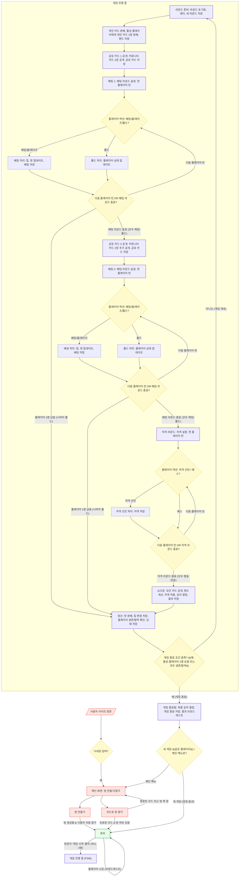

```mermaid
graph TD
    A[/"사용자 사이트 방문"/] --> B{닉네임 입력?};
    B -- 예 --> C[메인 화면: 방 만들기/참가];
    C --> D[방 만들기];
    D -- 방 생성됨 & 사용자 자동 참가 --> E[로비];
    C --> F[코드로 방 참가];
    F -- 유효한 코드 & 방 여유 있음 --> E;
    F -- 잘못된 코드 또는 방 꽉 참 --> C;

    E -- 플레이어 참가 (브로드캐스트) --> E;
    E -- 플레이어 나감 (브로드캐스트) --> E;
    E -- 방장이 '게임 시작' 클릭 (최소 2명) --> G_IP["게임 진행 중 (FSM)"];

    subgraph 게임 진행 중
        direction LR
        RSR[라운드 준비: 라운드 초기화, 앤티, 새 라운드 저장] --> DPC[개인 카드 분배: 활성 플레이어에게 개인 카드 2장 분배, 핸드 저장];
        DPC --> DSC1[공유 카드 1 공개: 커뮤니티 카드 2장 공개, 공유 카드 저장];
        DSC1 --> B1[베팅 1: 베팅 라운드 설정, 첫 플레이어 턴];

        B1 --> B1_Action{플레이어 액션: 베팅/콜/레이즈/폴드?};
        B1_Action -- 베팅/콜/레이즈 --> B1_ProcessBet[베팅 처리: 칩, 팟 업데이트, 베팅 저장];
        B1_ProcessBet --> B1_NextPlayer{다음 플레이어 턴 OR 베팅 라운드 종료?};
        B1_Action -- 폴드 --> B1_ProcessFold[폴드 처리: 플레이어 상태 업데이트];
        B1_ProcessFold --> B1_NextPlayer;
        B1_NextPlayer -- 다음 플레이어 턴 --> B1_Action;
        B1_NextPlayer -- 베팅 라운드 종료 (모두 매칭/폴드) --> DSC2[공유 카드 2 공개: 커뮤니티 카드 2장 추가 공개, 공유 카드 저장];
        B1_NextPlayer -- 플레이어 1명 남음 (나머지 폴드) --> Settle[정산];

        DSC2 --> B2[베팅 2: 베팅 라운드 설정, 첫 플레이어 턴];
        B2 --> B2_Action{플레이어 액션: 베팅/콜/레이즈/폴드?};
        B2_Action -- 베팅/콜/레이즈 --> B2_ProcessBet[베팅 처리: 칩, 팟 업데이트, 베팅 저장];
        B2_ProcessBet --> B2_NextPlayer{다음 플레이어 턴 OR 베팅 라운드 종료?};
        B2_Action -- 폴드 --> B2_ProcessFold[폴드 처리: 플레이어 상태 업데이트];
        B2_ProcessFold --> B2_NextPlayer;
        B2_NextPlayer -- 다음 플레이어 턴 --> B2_Action;
        B2_NextPlayer -- 베팅 라운드 종료 (모두 매칭/폴드) --> Sniping[저격 라운드: 저격 설정, 첫 플레이어 턴];
        B2_NextPlayer -- 플레이어 1명 남음 (나머지 폴드) --> Settle;

        Sniping --> Sniping_Action{플레이어 액션: 저격 선언 / 패스?};
        Sniping_Action -- 저격 선언 --> Sniping_Process[저격 선언 처리: 저격 저장];
        Sniping_Process --> Sniping_NextPlayer{다음 플레이어 턴 OR 저격 라운드 종료?};
        Sniping_Action -- 패스 --> Sniping_NextPlayer;
        Sniping_NextPlayer -- 다음 플레이어 턴 --> Sniping_Action;
        Sniping_NextPlayer -- 저격 라운드 종료 (모두 행동 완료) --> Show[쇼다운];

        Show[쇼다운: 모든 카드 공개, 핸드 계산, 저격 적용, 승자 결정, 결과 저장] --> Settle;
        Settle[정산: 팟 분배, 칩 변경 저장, 플레이어 생존/탈락 확인, 상태 저장] --> CheckGameOver{게임 종료 조건 충족? &#40;예: 활성 플레이어 1명 남음 또는 모두 생존/탈락&#41;};
        CheckGameOver -- 아니오 (게임 계속) --> RSR;
    end

    CheckGameOver -- 예 (게임 종료) --> GE[게임 종료됨: 최종 승자 결정, 게임 종료 저장, 결과 브로드캐스트];

    GE --> EndOptions{새 게임 &#40;같은 플레이어&#41; / 메인 메뉴로?};
    EndOptions -- 새 게임 (방장 옵션) --> E;
    EndOptions -- 메인 메뉴 --> C;

    %% Styling for FSM states
    classDef fsmState fill:#ececff,stroke:#9370db,stroke-width:2px,color:#333;
    class G_IP,RSR,DPC,DSC1,B1,DSC2,B2,Sniping,Show,Settle,GE fsmState;
    classDef lobbyState fill:#e6ffe6,stroke:#3cb371,stroke-width:2px,color:#333;
    class E lobbyState;
    classDef decision fill:#fffacd,stroke:#f0e68c,stroke-width:2px,color:#333;
    class B,B1_Action,B1_NextPlayer,B2_Action,B2_NextPlayer,Sniping_Action,Sniping_NextPlayer,CheckGameOver,EndOptions decision;
    classDef io fill:#ffe4e1,stroke:#fa8072,stroke-width:2px,color:#333;
    class A,C,D,F io;
```