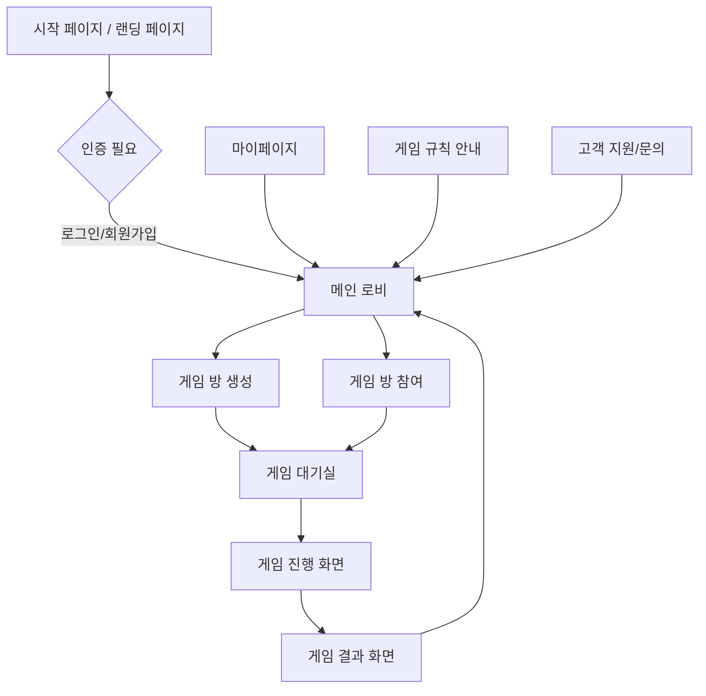

# 저격 홀덤 웹 - 정보 아키텍처(IA) 설계

## 1. 문서 개요

이 문서는 "저격 홀덤 웹" 애플리케이션의 정보 아키텍처(IA)를 정의합니다. `docs/prd.md`를 주요 레퍼런스로 삼아 사용자가 웹사이트와 상호작용하는 방식, 콘텐츠 구성, 네비게이션 흐름 등을 체계적으로 설계하는 것을 목표로 합니다.

본 IA 설계는 사용자 경험(UX) 최적화, 접근성 준수, 반응형 디자인 고려, SEO 기본 원칙을 염두에 두고 작성되었습니다.

## 2. 사이트 맵 (Site Map)



**주요 페이지 설명:**

*   **A. 시작 페이지 / 랜딩 페이지 (`/`)**:
    *   게임 소개, 주요 특징 안내.
    *   로그인/회원가입 유도 버튼.
*   **B. 인증 필요 (`/auth`)**: (실제 페이지라기보다 상태 또는 모달)
    *   닉네임 입력 기반 회원가입.
    *   기존 사용자 로그인 (Magic Link 등).
*   **C. 메인 로비 (`/lobby`)**:
    *   [게임 방 만들기] 버튼.
    *   [게임 방 참여하기] (방 코드 입력) 인터페이스.
    *   (선택 사항) 현재 활성화된 공개 방 목록.
    *   (MVP 이후) 마이페이지, 게임 규칙, 고객 지원 등 링크.
*   **D. 게임 방 생성 (`/create-room`)**: (실제로는 로비 내 기능으로 통합 가능)
    *   방 설정 (공개/비공개 등 - MVP에서는 기본 설정으로 단순화).
    *   생성 후 자동으로 게임 대기실로 이동.
*   **E. 게임 방 참여 (`/join-room`)**: (실제로는 로비 내 기능으로 통합 가능)
    *   방 코드 입력.
    *   성공 시 게임 대기실로 이동.
*   **F. 게임 대기실 (`/room/:roomId`)**:
    *   현재 참여 플레이어 목록 표시 (닉네임, 상태 등).
    *   방장에게 [게임 시작] 버튼 표시 (최소 인원 충족 시 활성화).
    *   [나가기] 버튼.
    *   실시간 채팅 (MVP 이후).
*   **G. 게임 진행 화면 (`/game/:gameId` 또는 `/room/:roomId/play`)**:
    *   개인 카드, 공유 카드, 플레이어 정보(칩, 상태), 베팅 옵션, 저격 옵션 등 표시.
    *   게임 로그/히스토리 표시.
    *   실시간 게임 상태 업데이트.
*   **H. 게임 결과 화면 (`/game/:gameId/results` 또는 `/room/:roomId/results`)**:
    *   최종 승자, 각 플레이어 칩 변화 등 결과 요약.
    *   [새 게임 시작] (방장 전용, 동일 멤버로 대기실 이동) 또는 [메인 로비로 돌아가기] 버튼.

## 3. 사용자 흐름 (User Flow)

### 3.1. 신규 사용자 게임 참여 흐름

1.  **방문**: 사용자가 웹사이트에 접속 (랜딩 페이지).
2.  **인증**: [게임 시작하기] 또는 유사 버튼 클릭 → 닉네임 입력 (회원가입/로그인 동시 처리).
3.  **로비 진입**: 인증 성공 후 메인 로비로 이동.
4.  **방 선택**:
    *   **방 만들기**: [방 만들기] 클릭 → (자동으로 생성된) 게임 대기실로 이동.
    *   **방 참여하기**: [방 참여하기] 클릭 → 친구에게 받은 방 코드 입력 → 게임 대기실로 이동.
5.  **게임 준비**: 게임 대기실에서 다른 플레이어 기다림. 방장은 [게임 시작] 버튼 클릭.
6.  **게임 플레이**: 게임 진행 화면으로 전환되어 게임 규칙에 따라 플레이.
7.  **게임 종료**: 게임 결과 화면에서 결과 확인.
8.  **후속 행동**: 메인 로비로 돌아가거나 새 게임 시작 (방장).

### 3.2. 기존 사용자 게임 참여 흐름

1.  **방문 및 인증**: 신규 사용자와 동일 (Magic Link 등으로 자동 로그인될 수 있음).
2.  이후 흐름은 신규 사용자와 동일.

### 3.3. 게임 중 주요 상호작용 흐름 (예: 베팅 라운드)

1.  **자신의 턴 알림**: UI를 통해 현재 자신의 턴임을 인지.
2.  **액션 선택**: [베팅], [콜], [레이즈], [폴드], [체크] 중 가능한 액션 버튼 활성화.
3.  **액션 실행**:
    *   [베팅]/[레이즈] 시: 베팅할 칩 액수 입력/선택 후 [확인] 버튼.
    *   [콜]/[체크]/[폴드] 시: 해당 액션 버튼 클릭.
4.  **결과 반영**: 선택한 액션이 서버로 전송되고, 게임 상태가 모든 플레이어에게 실시간 업데이트.
5.  **다음 턴**: 다음 플레이어에게 턴이 넘어감.

## 4. 네비게이션 구조 (Navigation Structure)

**인증 전 (Unauthenticated):**

*   주요 CTA: [로그인/시작하기]
*   부가 정보: 게임 소개, 간단한 규칙 안내 (랜딩 페이지 내)

**인증 후 (Authenticated):**

*   **주요 네비게이션 (항상 표시되거나 쉽게 접근 가능해야 함 - 예: 헤더)**:
    *   로고 (클릭 시 메인 로비로 이동)
    *   (MVP 이후) 사용자 닉네임/프로필 (드롭다운: 로그아웃, 마이페이지 등)
*   **컨텍스트 기반 네비게이션 (특정 화면/상황에서 제공)**:
    *   게임 대기실: [나가기]
    *   게임 진행 화면: (필요시) [게임 규칙 요약], [나가기/포기] (패널티 고려)
    *   게임 결과 화면: [메인 로비로], [새 게임 시작]

**푸터 네비게이션 (MVP 이후 고려):**

*   서비스 이용 약관
*   개인정보 처리방침
*   고객 지원/문의처

## 5. 페이지 계층 구조 (Page Hierarchy)

```
/ (랜딩 페이지)
    /auth (로그인/회원가입 처리 - 실제 경로는 아니지만 기능적 구분)
/lobby (메인 로비)
    /room/:roomId (게임 대기실)
        /play (게임 진행 - :roomId 하위로 통합 또는 별도 /game/:gameId도 가능)
        /results (게임 결과 - :roomId 하위로 통합)
```

*   **논리적 그룹핑**:
    *   **인증**: `/`, `/auth` (또는 모달)
    *   **게임 준비**: `/lobby`, `/room/:roomId`
    *   **게임 플레이**: `/room/:roomId/play` (또는 `/game/:gameId`)
    *   **게임 종료**: `/room/:roomId/results`

## 6. 콘텐츠 조직화 (Content Organization)

### 6.1. 랜딩 페이지 (`/`)

*   **핵심 메시지**: "저격 홀덤" 게임 소개, 간편한 참여 강조.
*   **주요 기능 소개**: 저격 시스템, 간소화된 카드, 생존/탈락 룰.
*   **CTA**: [게임 시작하기 / 로그인] 버튼.
*   **(선택)** 데모 영상 또는 이미지.

### 6.2. 메인 로비 (`/lobby`)

*   **핵심 기능**:
    *   방 만들기 버튼.
    *   방 참여 (코드 입력 필드 + 버튼).
*   **(선택)** 현재 참여 가능한 공개 방 목록 (카드 형태, 방 이름, 인원수 표시).
*   **(MVP 이후)** 내 정보, 게임 규칙 바로가기 등.

### 6.3. 게임 대기실 (`/room/:roomId`)

*   **핵심 정보**:
    *   방 코드 (공유용).
    *   참여 플레이어 목록 (닉네임, (준비 상태 - MVP 이후)).
    *   방장에게만 보이는 [게임 시작] 버튼.
*   **기능**:
    *   [나가기] 버튼.
    *   (MVP 이후) 채팅창.

### 6.4. 게임 진행 화면 (`/room/:roomId/play`)

*   **중앙 영역**:
    *   공유 카드 영역.
*   **각 플레이어 영역 (분산 배치)**:
    *   닉네임, 보유 칩, 현재 상태 (액션 대기, 폴드 등).
    *   개인 카드 (자신에게만 보이도록).
    *   베팅한 칩 표시.
*   **액션 컨트롤 영역**:
    *   베팅, 콜, 레이즈, 폴드, 체크, 저격 버튼 (상황에 따라 활성화/비활성화).
    *   베팅액 조절 슬라이더/입력 필드.
*   **정보 영역**:
    *   현재 턴, 진행 중인 베팅 라운드, 총 베팅액(팟).
    *   게임 로그/메시지.
*   **(선택)** 타이머 (턴 제한).

### 6.5. 게임 결과 화면 (`/room/:roomId/results`)

*   **핵심 정보**:
    *   "게임 종료" 또는 "최종 결과" 타이틀.
    *   승자 정보 (닉네임, 획득 칩 등).
    *   모든 플레이어의 최종 순위 및 칩 변화.
*   **CTA**:
    *   [메인 로비로 돌아가기] 버튼.
    *   (방장) [같은 멤버로 새 게임 시작] 버튼.

## 7. 상호작용 패턴 (Interaction Patterns)

*   **실시간 업데이트**: Supabase Realtime을 활용하여 게임 상태(카드, 칩, 플레이어 액션, 참여자 목록 등)는 사용자 입력 없이도 즉시 모든 클라이언트에 반영되어야 함.
    *   **입력**: 플레이어의 액션 (베팅, 저격 등).
    *   **출력**: 게임 보드 전체의 시각적 변화, 알림 메시지.
*   **모달/팝업**:
    *   로그인/회원가입.
    *   게임 규칙 요약 보기.
    *   게임 중 중요한 알림 (예: 생존 확정, 탈락).
    *   **입력**: 닉네임 입력, 버튼 클릭.
    *   **출력**: 메시지, 다음 단계 안내.
*   **버튼 및 CTA**:
    *   명확한 레이블 사용 (예: "방 만들기", "베팅하기", "저격하기").
    *   상태에 따른 비활성화 처리 (예: 최소 인원 미달 시 "게임 시작" 버튼 비활성화).
    *   **입력**: 클릭.
    *   **출력**: 해당 기능 실행, 페이지 이동, 상태 변경.
*   **폼 입력**:
    *   닉네임 설정, 방 코드 입력, 베팅액 입력.
    *   입력 유효성 검사 및 피드백 (예: "방 코드는 5자리입니다.").
    *   **입력**: 키보드 입력.
    *   **출력**: 입력값 표시, 오류 메시지.
*   **드래그 앤 드롭 / 슬라이더**:
    *   (선택) 베팅액 조절 시 슬라이더 사용 가능.
    *   **입력**: 마우스/터치 드래그.
    *   **출력**: 선택된 값 표시.
*   **피드백 및 알림**:
    *   토스트 메시지 (예: "성공적으로 방에 참여했습니다.", "저격에 성공했습니다!").
    *   시각적 강조 (예: 현재 턴인 플레이어 강조).
    *   사운드 효과 (카드 분배, 칩 이동 등 - MVP 이후).
    *   **입력**: 시스템 이벤트.
    *   **출력**: 시각적/청각적 알림.

## 8. URL 구조 (URL Structure)

*   **일관성**: 명사 중심의 RESTful 스타일을 지향.
*   **가독성**: 사람이 이해하기 쉬운 단어 사용 (한국어 음차 또는 간결한 영어).
*   **SEO 고려**: 주요 키워드 포함 (본 게임은 특수성이 강해 일반 SEO보다는 직접 공유가 많을 수 있음).

| 페이지/기능             | URL 예시                                 | 설명                                    |
|-------------------------|------------------------------------------|-----------------------------------------|
| 랜딩 페이지             | `/`                                      |                                         |
| 로그인/회원가입         | `/auth` (또는 모달 형태로 처리)            |                                         |
| 메인 로비               | `/lobby`                                 | 인증 후 기본 도착 페이지                   |
| 게임 방 (대기실)        | `/room/{roomId}`                         | `{roomId}`는 고유 방 ID (예: `ABCDE`)     |
| 게임 진행               | `/room/{roomId}/play`                    | 또는 `/game/{gameId}`도 고려 가능        |
| 게임 결과               | `/room/{roomId}/results`                 |                                         |
| (MVP 이후) 사용자 프로필 | `/profile/{username}` 또는 `/my-page`    |                                         |
| (MVP 이후) 게임 규칙 안내 | `/rules`                                 |                                         |

**고려사항**:

*   `{roomId}`는 짧고 기억하기 쉬운 형태 (예: Supabase의 기본 ID 대신 커스텀 생성 또는 매핑).
*   웹소켓 통신은 URL 구조와 직접적 연관은 없으나, 채널명 등에 `roomId`가 활용될 것.

## 9. 컴포넌트 계층 구조 (Component Hierarchy - 예시: 게임 진행 화면)

```
GamePage (`/room/:roomId/play`)
  ├── GameLayout (전체 게임 화면 레이아웃: 반응형 그리드 등)
  │   ├── SharedCardsDisplay (공유 카드 표시 영역)
  │   │   └── Card (개별 카드 컴포넌트) x N
  │   ├── PlayerArea (각 플레이어 정보 및 액션 영역) x N (플레이어 수만큼)
  │   │   ├── PlayerInfo (닉네임, 칩, 상태)
  │   │   ├── PersonalCardsDisplay (개인 카드 - 자신에게만 보임)
  │   │   │   └── Card x 2
  │   │   └── BetChipDisplay (현재 라운드 베팅 칩)
  │   ├── ActionControls (현재 턴인 플레이어의 액션 버튼 영역)
  │   │   ├── BetButton
  │   │   ├── CallButton
  │   │   ├── RaiseButton (클릭 시 BetInputModal 호출 가능)
  │   │   ├── FoldButton
  │   │   ├── CheckButton
  │   │   └── SnipeButton (클릭 시 SnipeModal 호출 가능)
  │   ├── PotDisplay (현재 판돈 표시)
  │   ├── GameLogDisplay (게임 진행 상황 텍스트 로그)
  │   └── (MVP 이후) TimerDisplay
  ├── BetInputModal (베팅액 입력 모달)
  │   └── NumberInput / Slider
  ├── SnipeModal (저격 선언 모달)
  │   ├── HandRankSelector (족보 선택)
  │   └── HighCardSelector (최고 숫자 선택)
  └── GameStatusNotification (게임 상태 변경 알림 - 예: 토스트)
```

**컴포넌트 재사용성**:

*   `Card`: 다양한 곳(개인 패, 공유 패, 최종 패)에서 재사용.
*   `Button`: 기본 버튼 스타일 및 상태(활성/비활성/로딩) 관리.
*   `Modal`: 기본 모달 틀 제공.

## 10. 접근성 (Accessibility - A11y) 고려사항

*   **키보드 네비게이션**: 모든 인터랙티브 요소는 키보드로 접근 및 조작 가능해야 함 (Tab, Shift+Tab, Enter, Space).
*   **시맨틱 HTML**: 적절한 HTML 태그 사용 (`<nav>`, `<main>`, `<button>`, `<h1>`-`<h6>` 등).
*   **ARIA 속성**: 동적 콘텐츠 및 커스텀 컨트롤에 ARIA (Accessible Rich Internet Applications) 속성 부여 (예: `aria-live`로 실시간 업데이트 영역 알림, `aria-label`로 아이콘 버튼 설명).
*   **명암 대비**: 텍스트와 배경 간 충분한 명암 대비 제공 (WCAG AA 기준 이상).
*   **대체 텍스트**: 의미 있는 이미지에는 `alt` 텍스트 제공. (본 게임은 UI 요소가 많으므로 아이콘 등에 `aria-label` 적극 활용)
*   **초점 관리**: 모달 창이 열릴 때 초점을 모달 내부로 이동시키고, 닫힐 때 이전 초점으로 복귀.
*   **반응형 디자인**: 다양한 화면 크기 및 확대/축소 레벨에서도 콘텐츠가 깨지지 않고 사용 가능하도록 설계.

## 11. 반응형 디자인 (Responsive Design) 고려사항

*   **모바일 우선(Mobile-First) 접근 방식** 또는 **데스크톱 우선 후 모바일 최적화** 중 프로젝트 특성에 맞춰 선택 (실시간 인터랙션이 많은 게임이므로 초기에는 데스크톱 환경을 기준으로 하되, 모바일 사용성을 염두에 둔 설계 필요).
*   **레이아웃 조정**: 화면 크기에 따라 컴포넌트 배치 변경 (예: PC에서는 넓게 펼쳐진 플레이어 정보, 모바일에서는 탭 또는 스크롤 가능한 목록으로 변경).
*   **터치 친화적 UI**: 버튼 크기, 간격 등 터치 입력에 적합하도록 디자인.
*   **이미지 최적화**: 화면 크기에 맞는 적절한 해상도의 이미지 제공.
*   **테스트**: 다양한 기기 및 브라우저 (특히 주요 타겟 사용자의 환경)에서 테스트.

## 12. SEO (Search Engine Optimization) 고려사항

*   **기본적 SEO**:
    *   적절한 `<title>` 태그 및 `<meta name="description">` 제공 (랜딩 페이지 중심).
    *   시맨틱 HTML 구조.
*   **페이지 속도**: 이미지 최적화, 코드 스플리팅 등으로 로딩 속도 개선.
*   **URL 구조**: 간결하고 의미 있는 URL 사용.
*   **내부 링크**: 주요 페이지 간 논리적 연결.
*   **저격 홀덤 게임 특성상**: 일반 검색 유입보다는 직접 링크 공유, 커뮤니티 언급을 통한 유입이 많을 것으로 예상. 따라서 핵심은 공유하기 쉬운 URL, 명확한 게임 소개(OG 태그 등)에 중점.

---

**참고 문서**:

*   `docs/prd.md`
*   `docs/story-board.md` (존재한다면)
*   `docs/functional-specification.md`

이 정보 아키텍처 문서는 프로젝트가 진행됨에 따라 변경될 수 있으며, 지속적인 검토와 업데이트가 필요합니다. 